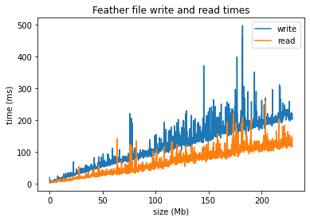
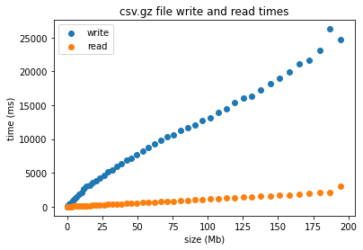
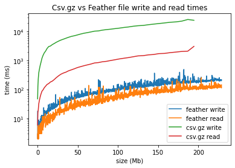

# Comparing Feather Again GZIP Compress CSV files reading/writing

This is a very simple display on some results of the read/write times of feather and gzip compressed files for different file sizes. It is a "knock out some results in an hour" kind of report, rather than actually comparing the pros and cons of the two file types for different purposes, or under various conditions

After comparing .feather files against .csv.gz, I have found that feather files are significantly faster at reading and writing than gzip compressed .csv files for the test case.

Here are some results after comparing them.

For feather files, reading and writing a dataframe of single column random numbers:
####

####

For gzip csv files, reading and writing the same inputs:
####

####

Comparison on a log plot (base 2):
####

